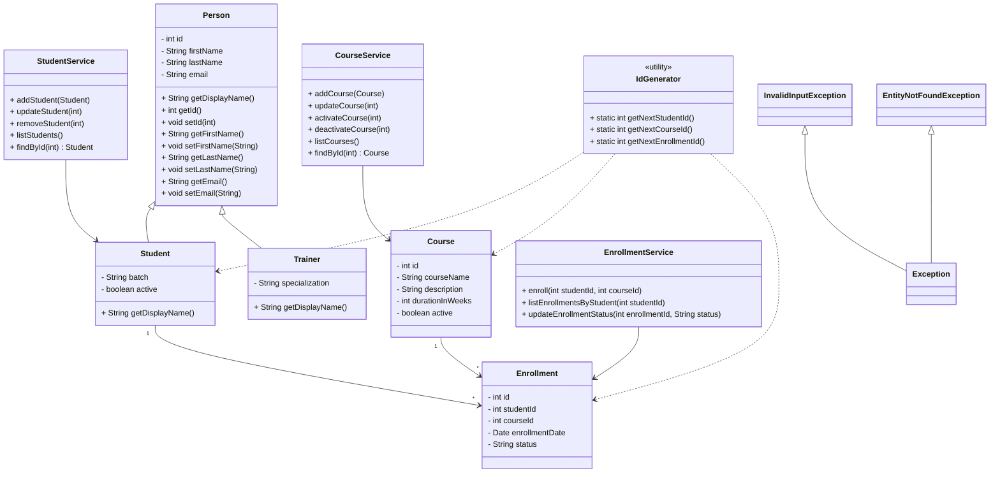

```mermaid
classDiagram
class Person {
    - int id
    - String firstName
    - String lastName
    - String email
    + String getDisplayName()
    + int getId()
    + void setId(int)
    + String getFirstName()
    + void setFirstName(String)
    + String getLastName()
    + void setLastName(String)
    + String getEmail()
    + void setEmail(String)
}

class Student {
    - String batch
    - boolean active
    + String getDisplayName()
}

class Trainer {
    - String specialization
    + String getDisplayName()
}

class Course {
    - int id
    - String courseName
    - String description
    - int durationInWeeks
    - boolean active
}

class Enrollment {
    - int id
    - int studentId
    - int courseId
    - Date enrollmentDate
    - String status
}

Person <|-- Student
Person <|-- Trainer

Student "1" --> "*" Enrollment
Course "1" --> "*" Enrollment

class StudentService {
    + addStudent(Student)
    + updateStudent(int)
    + removeStudent(int)
    + listStudents()
    + findById(int) Student
}

class CourseService {
    + addCourse(Course)
    + updateCourse(int)
    + activateCourse(int)
    + deactivateCourse(int)
    + listCourses()
    + findById(int) Course
}

class EnrollmentService {
    + enroll(int studentId, int courseId)
    + listEnrollmentsByStudent(int studentId)
    + updateEnrollmentStatus(int enrollmentId, String status)
}

class IdGenerator {
    <<utility>>
    + static int getNextStudentId()
    + static int getNextCourseId()
    + static int getNextEnrollmentId()
}

class InvalidInputException
class EntityNotFoundException

StudentService --> Student
CourseService --> Course
EnrollmentService --> Enrollment

IdGenerator ..> Student
IdGenerator ..> Course
IdGenerator ..> Enrollment

InvalidInputException <|-- Exception
EntityNotFoundException <|-- Exception
```
